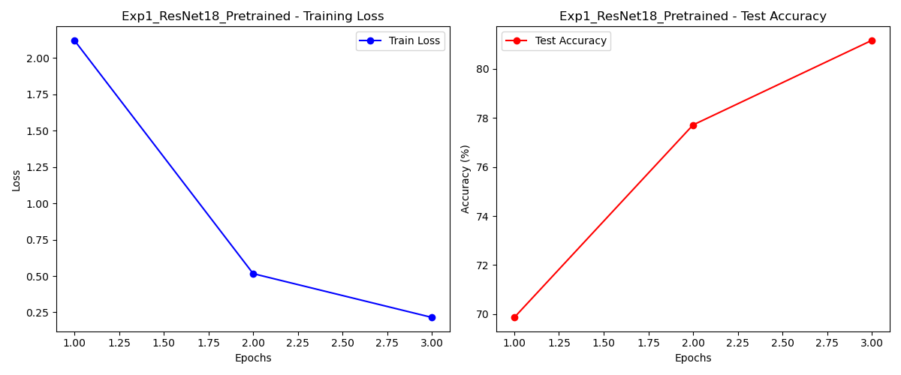
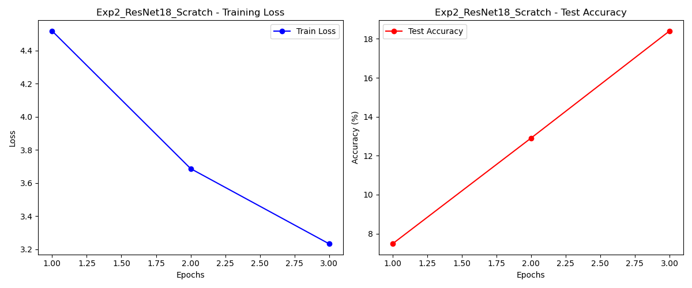
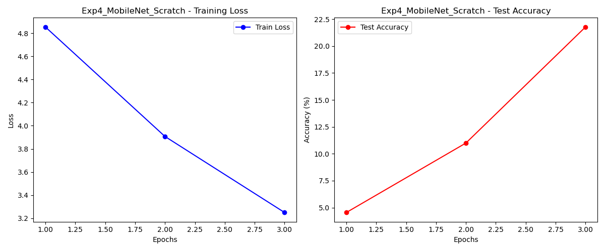
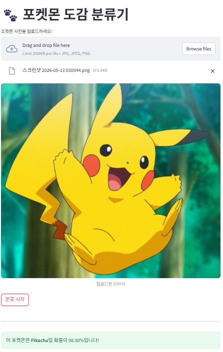

# 🐾 포켓몬 도감 분류기 (Pokemon Classifier)

다양한 딥러닝 이미지 분류 모델(CNN)을 활용하여 포켓몬 이미지를 분류하고, 최적의 성능을 내는 모델을 자동으로 선정하여 Streamlit 기반의 웹 데모 GUI 환경에서 테스트할 수 있는 엔드투엔드(End-to-End) 프로젝트입니다.

---

## 🚀 주요 기능 (Key Features)

* **4가지 실험 설정 및 성능 비교:**
  * `ResNet18` 및 `MobileNetV2` 구조 활용
  * 사전 학습된 가중치(Pretrained Weights) 사용 여부에 따른 성능 비교 연구
* **자동 최적 모델 저장 (`best_model.pth`):** 실험 진행 중 가장 높은 Test Accuracy를 기록한 모델의 가중치, 구조 정보, 클래스명을 자동으로 패키징하여 저장합니다.
* **학습 곡선(Learning Curve) 시각화:** 각 실험이 끝날 때마다 Loss 및 Accuracy 추이를 담은 그래프 플롯을 이미지 파일(`.png`)로 자동 생성합니다.
* **데모 GUI 애플리케이션:** Streamlit을 활용하여 사용자가 직접 포켓몬 이미지를 업로드하고 실시간으로 분류 결과를 확률(%)과 함께 확인할 수 있는 웹 인터페이스를 제공합니다.

---

## 📁 디렉토리 구조 (Directory Structure)

```text
├── PokemonData/              # 포켓몬 이미지 데이터셋 (하위 폴더명이 포켓몬 이름)
├── train.py                  # 4종 모델 학습, 비교 및 학습 곡선 생성 스크립트
├── app.py                    # Streamlit 기반 데모 웹 GUI 스크립트
├── best_model.pth            # [자동 생성] 가장 성능이 좋은 최적의 모델 파일
└── Exp*_learning_curve.png   # [자동 생성] 각 실험별 학습 곡선 그래프 이미지

---

## 각 모델의 learning curve





## 데모 GUI 실행 예제 이미지

